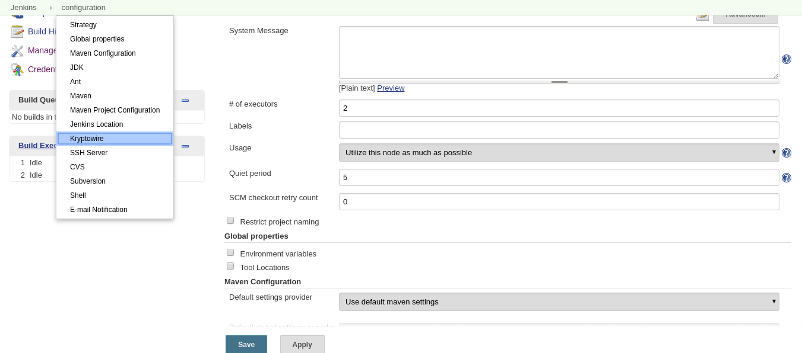
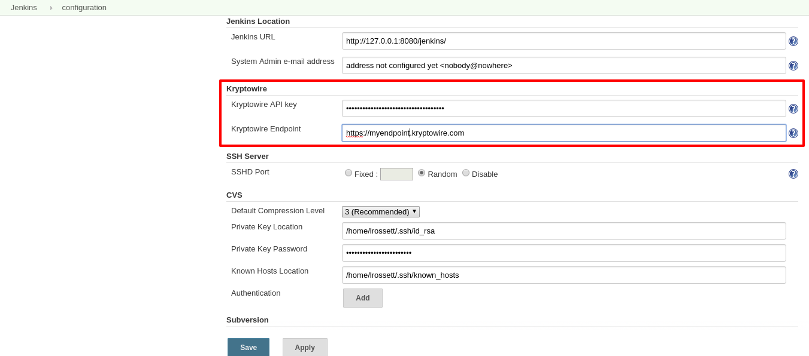
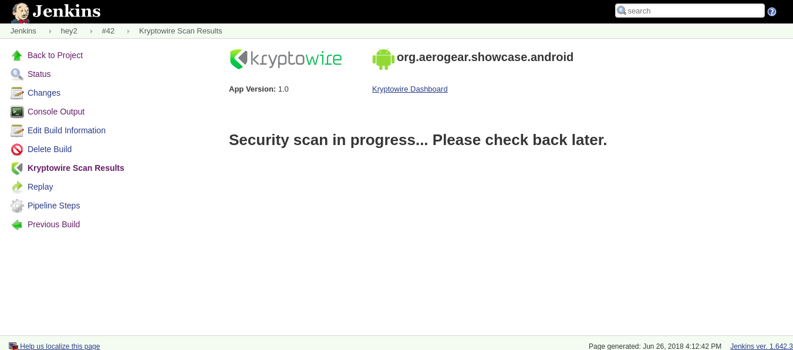
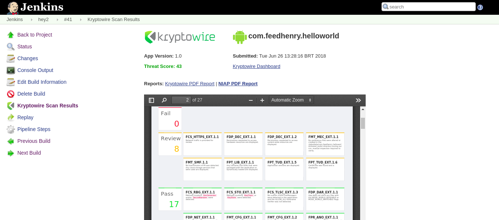
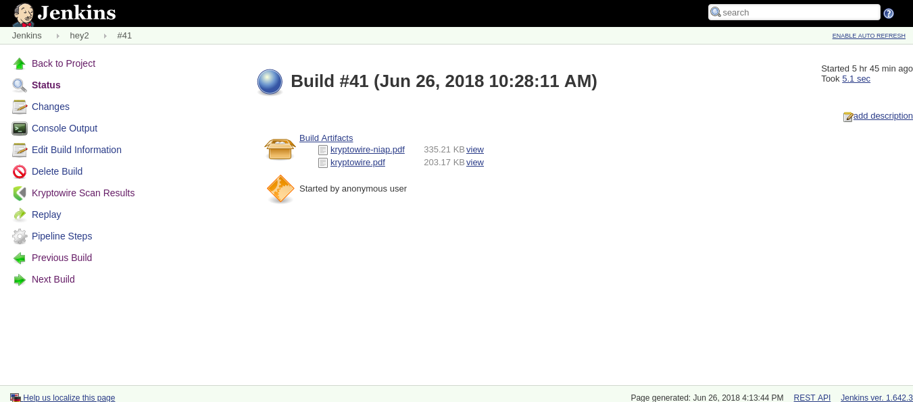

== Aerogear Kryptowire Jenkins Plugin

This Jenkins plugin integrates with the Kryptowire platform by adding the following features:

* Mobile application binary submission to the Kryptowire platform for security analysis
* Display security scan results in Jenkins
* Archives Kryptowire PDF reports as build artifacts

Supported mobile platforms:

* Android
* iOS

More details about the Kryptowire platform: https://www.kryptowire.com/

=== Usage

=== Kryptowire Global Configuration

You can set your Kryptowire global configuration in Jenkins configuration page (usually by acessing the `/configure` route).

You can quickly find the Kryptowire section from the top menu:



You will need to the required Kryptowire fields to use the DSL function:



Just click on "Save" at the bottom of the screen to save you Kryptowire configuration.

=== Pipeline DSL Function

The plugin adds a dsl function that can be used in a Jenkins pipeline script to send a app binary file for security analysis to the  Kryptowire platform.

Params:

* path: your mobile app binary path
* platform: the application mobile platform (`ios` or `android`)

```groovy
kwSubmit path: '/path/to/my/app-binary' platform: 'android'
```

Sample android (debug build) pipeline script (assumes you have a pre-configured android node):

```groovy
node('android') {
    stage 'Checkout'
    checkout scm

    stage 'Prepare'
    chmod +x './gradlew'

    stage 'Build'
    ./gradlew assembleDebug

    stage('Kryptowire')
    //using a try-catch block so the pipeline script won't fail if the krypowire plugin is not installed
    try {
        kwSubmit filePath: "app/build/outputs/apk/debug/app-debug.apk", platform: 'android'
    } catch(Error e) {
          e.printStackTrace()
    }

    stage 'Archive'
    archiveArtifacts artifacts: 'app/build/outputs/apk/debug/app-debug.apk', excludes: 'app/build/outputs/apk/*-unaligned.apk'
}
```

You can see your analysis status by clicking on the left menu kryptowire item (once the build is finished):



It may take a while to process your binary but the screen will show more details once the analysis is done:



The PDF reports are archived as build artifacts which can also be downloaded in the build overview page:



NOTE: The plugin will archive the Kryptowire PDF reports by acessing the scan results page (it checks if the analysis is finished and if the PDF report was archived in Jenkins) - there is no background job that will execute such task.
